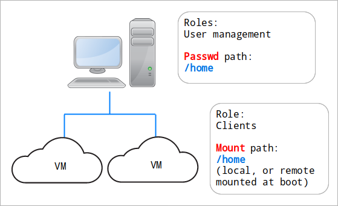
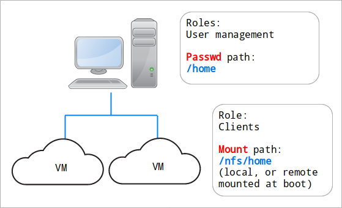

Basic examples
==============

Configuring the Hesutils
------------------------

In standard installations, the Hesutils configuration file is located in ``/etc/hesutils.conf``.

Hesiod domain
~~~~~~~~~~~~~

The most important thing is to define the domain that you want to use for Hesiod. The default is ``.hesiod``, which is OK for testing (and easy log grepping), but probably not for production.

By tradition Hesiod lives under ``.ns.<your domain>``::

    LHS=.ns
    RHS=.<your domain>

But there is no obligation whatsoever. Do whatever you want.

Remember to keep the values of ``/etc/hesiod.conf`` in sync with the Hesutils configuration.

Output
~~~~~~

Change the output format to match your DNS server, for example::

    OUTPUTFMT="bind"

UID and GID ranges
~~~~~~~~~~~~~~~~~~

Define which UID and GID ranges will be translated to Hesiod records. Those are the default values::

    UIDMIN=5000
    UIDMAX=5999
    GIDMIN=${UIDMIN}
    GIDMAX=${UIDMAX}

User and group management
-------------------------

**Note:** The following examples modify the system's databases, not the Hesiod records. The latter need to be regenerated after each set of modifications to the system databases.

Adding user and groups
~~~~~~~~~~~~~~~~~~~~~~

Users and groups are added through the ``hesadd`` command, and its aliases ``hesuseradd`` and ``hesgroupadd``.

This command accepts the same options as the normal ``useradd`` and ``groupadd``. In fact the only thing it does is add the right options to create the users and groups within the Hesiod UID and GID ranges, as defines in ``/etc/hesutils.conf``.

Add a user::

    $ sudo hesadd useradd -M joe

    $ id joe
    uid=5000(joe) gid=5000(joe) groups=5000(joe)

**Note:** ``useradd`` checks whether the username already exists. If your nsswitch is configured to use Hesiod, it will query Hesiod too -- and fail if a Hesiod user of that name exists, even if there is no such local user.

Add a group::

    $ sudo ./hesadd groupadd extragrp

    $ getent group extragrp
    extragrp:x:5001:

Modifying user accounts
~~~~~~~~~~~~~~~~~~~~~~~

Modifying user accounts is done through standard system tools.

Add a secondary group to an existing user::

    $ sudo usermod -a -G extragrp joe

    $ id joe
    uid=5000(joe) gid=5000(joe) groups=5000(joe),5001(extragrp)

Deleting users and groups
~~~~~~~~~~~~~~~~~~~~~~~~~

Deleting users and groups is done through the standard system tools.

Add another user account and delete it::

    $ sudo hesadd useradd -M wronguser

    $ id wronguser 
    uid=5001(wronguser) gid=5002(wronguser) groups=5002(wronguser)

    $ sudo userdel wronguser

    $ id wronguser
    id: ‘wronguser’: no such user

Overriding the ID ranges
~~~~~~~~~~~~~~~~~~~~~~~~

It might be useful to specify a different subrange within the Hesiod range, for example to avoid mixing secondary GIDs with the primaries.

Add a group, overriding the lower bound of the Hesiod GID range::

    $ sudo hesadd groupadd -K GID_MIN=5300 uppergrp

    $ getent group uppergrp 
    uppergrp:x:5300:

See the `useradd <https://manpages.ubuntu.com/manpages/focal/en/man8/useradd.8.html>`__ and `groupadd <https://manpages.ubuntu.com/manpages/focal/en/man8/groupadd.8.html>`__ manpages for other range options.

Translating accounts to Hesiod
------------------------------

Once the configuration file is setup to your liking, translating the records is simple.

At the end of the few commands above, the records are::

    $ hesgen

    # Generated by hesgen on Tue Mar 16 21:34:29 CET 2021
    
    local=/ns.athena.mit.edu/
    local=/hesiod/
    
    # Users
    txt-record=joe.passwd.hesiod,"joe:*:5000:5000::/home/joe:"
    txt-record=5000.uid.hesiod,"joe:*:5000:5000::/home/joe:"
    
    # Groups
    txt-record=joe.group.hesiod,"joe:x:5000:"
    txt-record=5000.gid.hesiod,"joe:x:5000:"
    txt-record=extragrp.group.hesiod,"extragrp:x:5001:"
    txt-record=5001.gid.hesiod,"extragrp:x:5001:"
    txt-record=uppergrp.group.hesiod,"uppergrp:x:5300:"
    txt-record=5300.gid.hesiod,"uppergrp:x:5300:"
    
    # Group lists
    txt-record=joe.grplist.hesiod,"extragrp"

This was generated using the default configuration, which is::

    LHS=
    RHS=.hesiod
    UIDMIN=5000
    UIDMAX=5999
    GIDMIN=${UIDMIN}
    GIDMAX=${UIDMAX}
    TRIMGECOS=1
    FULLMEMBERLIST=0
    USERGRPLIST=1
    NAMELISTS=1
    HOMESEDEXPORT=
    HOMESEDMOUNT=
    FSMAPFILE=
    FSCOMMAND=
    FILSYS=0
    FILSYSAUTO=0
    FSTYPE=NFS
    NFSSERVER=$(hostname -f)
    FSDEVICE=
    FSMOUNTOPTS="rw"
    OUTPUTFMT="dnsmasq"
    CREATEZONE=1
    TTL=
    CLASS=
    SOA=
    BLOCKUPSTREAM=1
    BLOCKATHENA=1

*Note:* Those values are the default values when the parameters are not set. Therefore running ``hesgen`` without a configuration file will produce the same results as the default configuration file, and so will an empty configuration file.

Try it! ::

    $ touch /tmp/empty.conf
    $ hesgen -c /tmp/empty.conf

Thanks to this property, only the non-default parameters need to be defined in the configuration file.

So the following configuration::

    FULLMEMBERLIST=1
    OUTPUTFMT=bind
    CREATEZONE=0

Is enough to produce this output::

    ; Generated by hesgen on Tue Mar 16 21:45:18 CET 2021

    ; Users
    joe.passwd      TXT    "joe:*:5000:5000::/home/joe:"
    5000.uid        CNAME  joe.passwd

    ; Groups
    joe.group       TXT    "joe:x:5000:joe"
    5000.gid        CNAME  joe.group
    extragrp.group  TXT    "extragrp:x:5001:joe"
    5001.gid        CNAME  extragrp.group
    uppergrp.group  TXT    "uppergrp:x:5300:"
    5300.gid        CNAME  uppergrp.group

    ; Group lists
    joe.grplist     TXT    "extragrp"

Everything else is default.

Modifying the home path
-----------------------

**Note:** `The curious case of the multiple home paths <hes_homepaths.rst>`__ is pretty much mandatory reading to understand this section. So is `Homepaths and FILSYS records <hes_filsys.rst>`__.

Let's say that we have a couple of VMs running on a system and we want to provide identification services to the VM. The next examples show some use cases.

**Note:** In the following examples ``joe`` is the type specimen of the user species. While I am only using a single such account in my examples, it can be assumed that there are lots of almost-identical Joe and Jane accounts for the dwellers of this cold, dark electronic world.

Example 1: nothing to do
~~~~~~~~~~~~~~~~~~~~~~~~

In this use case:

- the homes are either local, or remote and mounted at boot (no automounting);
- the user home directories on the clients are exactly the same as on the management machine;
- the Hesiod user home directories are perfectly regular (all *passwd paths* are ``/home/<user>``).

This is the ideal case. As the *passwd path* and the *mount path* are the same, no change is required!

Example 2: transforming the home directories
~~~~~~~~~~~~~~~~~~~~~~~~~~~~~~~~~~~~~~~~~~~~

In this use case:

- the homes are either local, or remote and mounted at boot (no automounting);
- the home directories on the clients are different from what they are on the management machine;
- the Hesiod user home directories are perfectly regular (all *passwd paths* are ``/home/<user>``, and all *mount paths* are ``/nfs/home/<user>``).

We can use the parameter ``HOMESEDMOUNT`` to transform the *passwd path* (the one in the passwd file) into the *mount path* (the equivalent home directory on the client node -- it's called **mount** path because that's where the home directory will be automounted when creating FILSYS records, and although we're not automounting that's still what it's called).

``HOMESEDMOUNT`` is a sed expression. It's that simple. The sed expression for our transformation is::

    $ echo /home | sed -e 's:^:/nfs:'
    /nfs/home

In other words, we insert the ``/nfs`` in front of *passwd path*. It's quite easy.

Our original PASSWD record for Joe looked like this::

    joe.passwd      TXT    "joe:*:5000:5000::/home/joe:"

Now, using this configuration::

    FULLMEMBERLIST=1
    OUTPUTFMT=bind
    CREATEZONE=0
    HOMESEDMOUNT='s:^:/nfs:'

We obtain this record::

    joe.passwd      TXT    "joe:*:5000:5000::/nfs/home/joe:"

Example 3: using a static map
~~~~~~~~~~~~~~~~~~~~~~~~~~~~~

Let's start with the same situation as example 2, but this time we have a special case. One of the accounts is an admin account, which has a local home on each and every client. That way the admin can log in even if NFS is down.

So while the home paths of all our other users need to be transformed to be in ``/nfs/home``, the home of the admin needs to stay the same.

First add the admin user to the management system's database::

    $ sudo hesadd useradd -K UID_MIN=5700 -K GID_MIN=5700 -M -d /home/admin admin

    $ id admin 
    uid=5700(admin) gid=5700(admin) groups=5700(admin)

If you look at the configuration flow in `Homepaths and FILSYS records <hes_filsys.rst>`__, you will see that we can modify the path through two other mechanisms: the static map file, and the dynamic map command. In this case the static map file is a perfect choice.

The contents of the file are in the format::

    <user name>  <mount path>

If an entry is found for a given user, then the mount path in that entry will replace entirely the mount path in the record.

The path of the map file is specified with the parameter ``FSMAPFILE``.

Our last configuration was::

    FULLMEMBERLIST=1
    OUTPUTFMT=bind
    CREATEZONE=0
    HOMESEDMOUNT='s:^:/nfs:'

With that configuration we obtain those records::

    joe.passwd      TXT    "joe:*:5000:5000::/nfs/home/joe:"
    admin.passwd    TXT    "admin:*:5700:5700::/nfs/home/admin:"

It's OK for all the Joes and Janes, but not for the admin.

Let's use a map file to redefine the admin's home path::

    FULLMEMBERLIST=1
    OUTPUTFMT=bind
    CREATEZONE=0
    HOMESEDMOUNT='s:^:/nfs:'
    FSMAPFILE=/tmp/map.conf

And the map file contains this::

    $ cat /tmp/map.conf 
    admin /home/admin

Re-running ``hesgen`` gives us what we expect::

    joe.passwd      TXT    "joe:*:5000:5000::/nfs/home/joe:"
    admin.passwd    TXT    "admin:*:5700:5700::/home/admin:"

Example 4: use a map script
~~~~~~~~~~~~~~~~~~~~~~~~~~~

Finally, let's add another layer of complexity.

Our corporate overlord ACME Corp. just acquired (back) the assets of Wile E. Coyote Inc., when it went bankrupt following years pursuing the elusive Road Runner agile buzzword. Its employees have also joined the company, and for now their home directories are still stored on a separate server, mounted on a separate mount point.

We have:

- normal users: ``/nfs/home/<username>``;
- admin: ``/home/admin``;
- new users: ``/coyote/<username>``.

And we've made sure that all our new users are members of the secondary group ``coyote``.

We could fix the admin's home path with a static entry easily, but doing this for tens or hundreds of people will get old really fast. We need a way to automate that. Enters the map command.

The map command is called with the contents of the passwd entry for that user as parameter, already split at the colons. The output of the command is in the exact same format as the static map file.

If the passwd entry is this::

    joe:x:5000:5000::/home/joe:

Then the command will be called like this::

    $FSCOMMAND "joe" "x" "5000" "5000" "" "/home/joe" ""

And the expected return is this::

    joe  <new mount path>

**Note:** The command is called for each Hesiod users, when translating their record. But it doesn't need to return something for each and every user. If nothing is returned, then the mount path stays the same.

Back to our story, we now have a new user and some new groups::

    $ id wile
    uid=5002(wile) gid=5002(wile) groups=5002(wile),5301(coyote)

    $ getent passwd wile 
    wile:x:5002:5002::/home/wile:

Let's create a script that takes a pre-split passwd line, and returns a different home path for members of ``coyote``::

    $ cat /tmp/map.sh
    #!/bin/bash

    # Map script
    # User in group "coyote" -> home directory is /coyote/<username>
    # Username is in $1

    groups "$1" | grep -qw "coyote" && echo "$1 /coyote/$1"

And we can check that it works::

    $ /tmp/map.sh wile x 5002 5002 '' /home/wile ''
    wile /coyote/wile

That's just what we needed.

Let's do one more update to our configuration file::

    FULLMEMBERLIST=1
    OUTPUTFMT=bind
    CREATEZONE=0
    HOMESEDMOUNT='s:^:/nfs:'
    FSMAPFILE=/tmp/map.conf
    FSCOMMAND=/tmp/map.sh

And re-running ``hesgen``, we obtain our final glorious set of records, using three different *mount path* transformation mechanisms::

    ; Generated by hesgen on Wed Mar 17 00:04:15 CET 2021
    
    ; Users
    joe.passwd      TXT    "joe:*:5000:5000::/nfs/home/joe:"
    5000.uid        CNAME  joe.passwd
    wile.passwd     TXT    "wile:*:5002:5002::/coyote/wile:"
    5002.uid        CNAME  wile.passwd
    admin.passwd    TXT    "admin:*:5700:5700::/home/admin:"
    5700.uid        CNAME  admin.passwd
    
    ; Groups
    joe.group       TXT    "joe:x:5000:joe"
    5000.gid        CNAME  joe.group
    extragrp.group  TXT    "extragrp:x:5001:joe"
    5001.gid        CNAME  extragrp.group
    wile.group      TXT    "wile:x:5002:wile"
    5002.gid        CNAME  wile.group
    uppergrp.group  TXT    "uppergrp:x:5300:"
    5300.gid        CNAME  uppergrp.group
    coyote.group    TXT    "coyote:x:5301:wile"
    5301.gid        CNAME  coyote.group
    admin.group     TXT    "admin:x:5700:admin"
    5700.gid        CNAME  admin.group
    
    ; Group lists
    joe.grplist     TXT    "extragrp"
    wile.grplist    TXT    "coyote"

