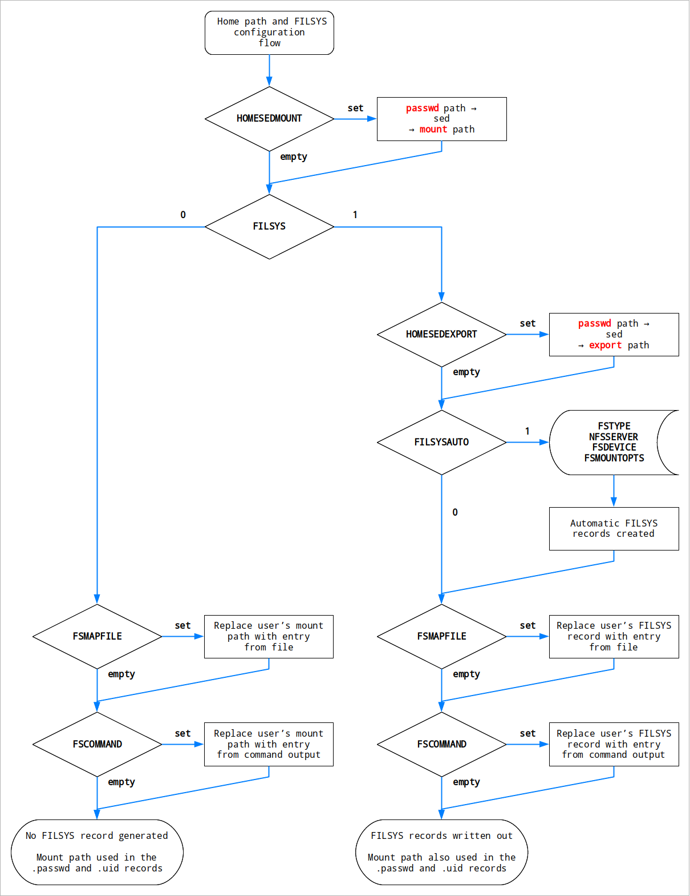

Homepaths and FILSYS records
============================

The generation of FILSYS records is a rather complex topic. One of the reasons for this is the existence of multiple separate paths in different places: ``/etc/passwd`` on the management system, and ``passwd`` and ``filsys`` Hesiod records.

This is documented in the `The curious case of the multiple home paths <hes_homepaths.rst>`__, which is mandatory prerequisite reading.

As implemented in the Hesutils, the non-FILSYS home directory modifications, to obtain the mount path from the passwd path, are a subset of the larger FILSYS generation codepath. The non-FILSYS configuration parameters are shared with the FILSYS case, although in some cases the behaviour might be slightly different. So it makes sense to explain the two cases together.

All parameters mentioned in this document are described in the Hesutils configuration file. This includes the default value that those take if not defined. It is highly recommended to read that additional information carefully, as it complements this document.

Configuration flow
------------------

The general configuration flow of both home path modifications and FILSYS record generation, are shown in this diagram:

General behaviour
-----------------

The various operations are controlled by their respective variables. If they are set, then the operation will be applied to either the various paths, or the FILSYS records.

Each operation applies to the state after all previous operations have completed. By selectively enabling or disabling some operations, (overly) complex architectures can be represented.

Note on the various FILSYS formats
----------------------------------

Currently the Hesutils can generate 3 different FILSYS formats, supported by the Linux automounter::

    <user name>  AFS  <export path>  <mount options>  <mount path>
    <user name>  NFS  <export path>  <server>  <mount options>  <mount path>
    <user name>  <FS type>  <device>  <mount options>  <mount path>

The two first formats are the historical ones, from Project Athena. The third one is a generic format added later, which allows arbitrary filesystems, both local and remote, to be automounted.

In the generic format, the ``<device>`` is essentially anything that can work in the first field of an ``/etc/fstab`` entry.

This means that an NFSv4 FILSYS record can be represented in two different ways, the classic one and the generic one::

    joe.filsys          TXT    "NFS /export/home/joe nfssrv rw,nfsvers=4 /mnt/nfs/home/joe"
    joe.filsys          TXT    "nfs4 nfssrv:/export/home/joe rw /mnt/nfs/home/joe"

In the generic record, the device contains both the NFS server and the export path.

Selection of the record format in `The automatic FILSYS records`_ is done via the ``FSTYPE``: if it's "NFS" (upper or lower case), then it's the classic path. If it's "nfs4" (or anything else for that matter), then it's the generic format.

The home path modifications
---------------------------

The home path modifications are the various ways in which the *passwd path* can be tweaked to generate different *export path* (FILSYS only) and *mount path*.

Currently this is controlled by two options:

- ``HOMESEDMOUNT``, to get the mount path;
- ``HOMESEDEXPORT``, to get the export path.

Both of those are simply ``sed`` scripts (the ``-e`` parameter). Using them is pretty straightforward.

If either of them is not defined, then the respective path stays identical to the passwd path.

Non-FILSYS example:
~~~~~~~~~~~~~~~~~~~

User ``joe``'s entry in ``/etc/passwd`` looks like this::

    joe:x:5000:5000:,,,:/home/joe:/bin/bash
                        ^^^^^^^^^
                       passwd path

``/home/joe`` is the *passwd path*.

On the management system, all users have their home directory in ``/home``. But on the client systems, the homes are mounted under ``/mnt/nfs/home``, and the passwd path wouldn't work.

And so we define ``HOMESEDMOUNT`` as a sed script to do the changed for us::

    HOMESEDMOUNT='s:^:/mnt/nfs:'

Running ``hesgen`` gives us the expected *mount path*::

    joe.passwd          TXT    "joe:*:5000:5000:,,,:/mnt/nfs/home/joe:/bin/bash"
                                                    ^^^^^^^^^^^^^^^^^
                                                       mount path

FILSYS example:
~~~~~~~~~~~~~~~

``HOMESEDEXPORT`` works in exactly the same way, but for the filesystem *export path* in FILSYS records.

Keeping with the same management system's ``/etc/passwd`` entry for our user ``joe``, it might be that on the NFS servers the homes are exported under ``/export/home``.

We can define ``HOMESEDEXPORT`` to modify the passwd path and get our *export path*::

    HOMESEDEXPORT='s:^:/export:'

And then Joe's FILSYS record might look like this::

    joe.filsys          TXT    "NFS /export/home/joe nfssrv rw /mnt/nfs/home/joe"
                                    ^^^^^^^^^^^^^^^^           ^^^^^^^^^^^^^^^^^
                                      export path                 mount path

The automatic FILSYS records
----------------------------

The automatic FILSYS records, controlled by the parameter ``FILSYSAUTO``, are a way of batch-creating records for all users.

If your system design is homogeneous, all users will have regular FILSYS records:

- same filesystem type;
- same file server (for classic NFS);
- same device (for generic records);
- and same mount options.

The parameters ``FSTYPE``, ``NFSSERVER``, ``FSDEVICE`` and ``FSMOUNTOPTS`` are there for that very purpose. If ``FILSYSAUTO=1``, ``hesgen`` will use their contents to populate FILSYS records for all users.

If the filesystem is NFS, the file server is the localhost on which the script is running and the mount options are ``rw``, then you don't even need to set the parameters. Those are the default values, which should be a good fit for a lot of small-scale deployments.

The map file and command
------------------------

The next step in the pipeline are the user-provided map file and map command. They both have the same role: provide a complete record that replaces any previous one.

The map file, which path is stored in ``FSMAPFILE``, contains static records. It is parsed to find entries that match the user for which a record is being generated. The acceptable record formats are the same as in `Note on the various FILSYS formats`_.

The map command, which name or full path is stored in ``FSCOMMAND``, is executed once per user exported to Hesiod. It is called with the contents of the fstab entry for that user passed as parameters, pre-split. The command returns records in one of the formats described in `Note on the various FILSYS formats`_.

Neither the map file nor the command are expected to contain or return records for each and every Hesiod users. For example they can be used to override the automatic FILSYS records for a subset of users. The command (typically a script of some sort) allows for more refined rules to be implemented, for example changing the filesystem servers or paths based on group memberships.

The records can either be user-specific, with the first field being the user name, or generic, with the first field being ``*``::

    joe NFS /export/home/joe nfssrv rw /mnt/nfs/home/joe
    * NFS /export/home nfssrv rw /mnt/nfs/home

This changes the way the records are processed, see below for more details.

Without FILSYS
~~~~~~~~~~~~~~

When no FILSYS records are required, ``hesgen`` will ignore generic (``*``) records. Only user-specific records will be considered.

Full FILSYS records are not required in that case, so the records can be shortened to this format::

    <user name>  <mount path>

When encountering such a record, the existing mount path for that user will be replaced with the one provided in the record. If multiple records are found in the map file or the command output, the last one is the effective one.

With FILSYS
~~~~~~~~~~~

When FILSYS records are required, ``hesgen`` will accept both user-specific and generic records.

In both cases, the record obtained will overwrite the current existing FILSYS record for that user. If the record contains only one field (username or ``*``), then the FILSYS record for that user is cleared entirely.

If it's a user-specific record, then the mount path from the record overwrites the existing mount path for that user. If it's a generic record, then the existing mount path stays the same.

When encountering multiple records of either type, the last one is the effective one.

Examples
~~~~~~~~

Examples of usage of the map file and command are included in `Advanced examples <ex_advanced.rst>`__.

