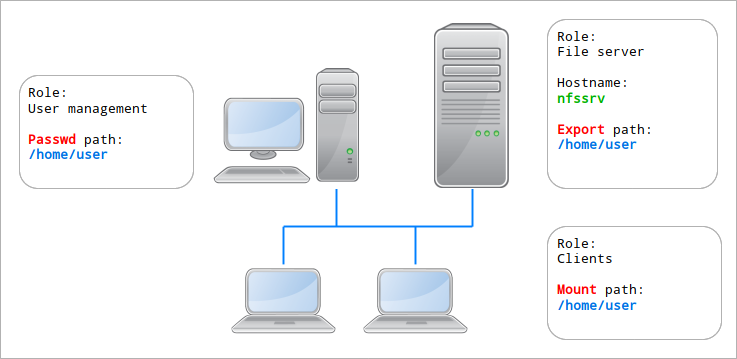
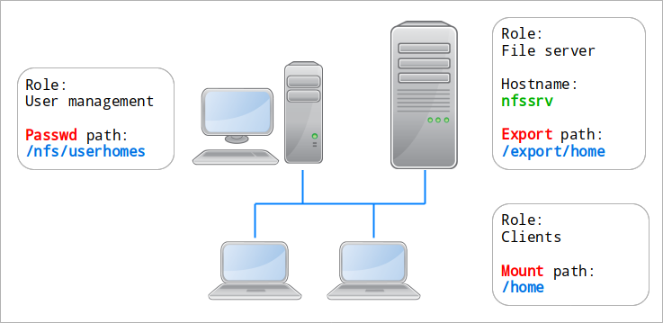

The problem of the multiple home paths
======================================

When generating Hesiod ``passwd`` and ``FILSYS`` records, an interesting problem arises: the possible existence of different home paths.

Let's have a look at an entry from ``/etc/passwd`` on the management system::

    joe:x:5000:5000:,,,:/home/joe:/bin/bash

The 6th field, just before the shell, is the user's home directory: ``/home/joe``. It's assumed to exist and be valid on that local system.

If we translate it directly to a Hesiod record, we get this::

    joe.passwd      TXT    "joe:x:5000:5000:,,,:/home/joe:/bin/bash"

Here comes the first problem: *the home path may not be the same on the client systems*!

There can be multiple causes for that. The most common one is that the homes are shared to all clients via a network filesystem like NFS, and the mount point on the client is not the same as on the management system. So user accounts are created with the management's view of the home directories, which doesn't work anymore on the clients.

This means that the Hesiod ``passwd`` record may need to contain a home path that's different from the entry in the management's ``/etc/passwd`` file. This may look like this::

    joe.passwd      TXT    "joe:x:5000:5000:,,,:/nfs/home/joe:/bin/bash"

Then, an NFS mount (or any other network FS) means an export path as well as a mount path. Very often the whole home directory root will be mounted at boot on the clients via ``fstab`` or ``systemd-mount``, and in that case there's nothing to worry about. But if you want to have automounting based on FILSYS records, there's a third possible path: the export path for that user.

If we have a look at a sample FILSYS record, we can see two different paths::

    joe.filsys      TXT    "NFS /export/home/joe nfssrv rw /nfs/home/joe"

The first one is the export path on the NFS server, and the second one is the mount point on the client system.

Altogether, there are three separate home paths involved in the Hesutils model:

- the **passwd path**, in the ``/etc/passwd`` entry for a user on the management system;

- the **export path** on the network FS server for that user, used in FILSYS records only;

- and the **mount path**, which is the home path of the user on the client system.

The *passwd path* and the *mount path* are always present, regardless of whether FILSYS records are generated. The *export path* only exists in FILSYS records.

There are cases where the system will have been designed carefully and the three paths will be the same:

At the other extreme, all three paths may be different:

The Hesutils provide powerful, sophisticated, multi-layered, flexible, software-defined, user-extensible and grossly overkill mechanisms of home path modifications. Those can generate the export and mount paths from the home paths, or replace them with arbitrary values.

As the non-FILSYS case is a slightly simpler version of the FILSYS case, both are documented in `FILSYS records <hes_filsys.rst>`__.

