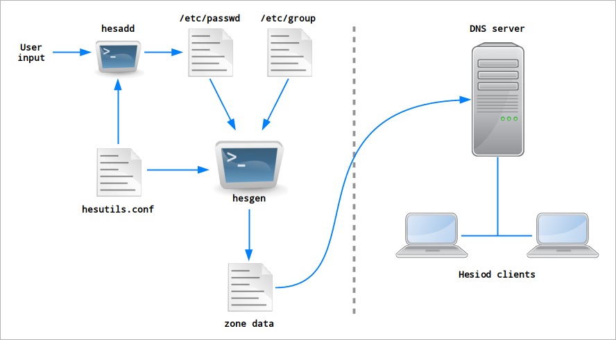

The Hesutils model of operations
================================

The general model of operations of the Hesutils can be summarized in a picture:

Generation of Hesiod records
----------------------------

``Hesgen`` takes as input the standard ``/etc/passwd`` and ``/etc/group`` files and generates Hesiod records based on that information.

The users and groups to be translated to Hesiod records are identified by their UID and GID. The configuration file include parameters that define the Hesiod ranges, and only users and groups whose UIDs and GIDs are within those ranges will be translated to Hesiod record.

The default Hesiod user and group ranges are both ``[5000-5999]``. ``Hesgen`` will refuse to translate system entries (UID or GID below 1000).

By default ``hesgen`` will read the system-wide ``/etc/passwd`` and ``/etc/group`` files. It is possible to override this and provide input files in different paths. This is useful in various situations, for example translating entries from hand-edited files. Another use case is generating the Hesiod records on an isolated DNSSEC machine used to sign zones.

Hesiod records need to be regenerated after each change to entries within the Hesiod ranges.

The records are written to ``hesgen``'s stdout, and the warnings and errors to stderr. In many cases the output can be written to a file that can be copied as-is to the DNS server's configuration folder, although it is highly recommended to inspect the output before doing so. Additionally, please refer to `Passwords and security concerns <hes_sec.rst>`__ before publishing those records in your DNS without any security.

User and group management
-------------------------

Adding user and group entries is done with the standard UNIX tools, typically ``useradd`` and ``groupadd``.

As users and groups need to be within the Hesiod ranges, the Hesutils provide ``hesadd``, which is a wrapper around the standard tools. It reads the Hesutils configuration file and adds the range bounds to the calls to the standard tools, creating users and groups that are within the Hesiod ranges.

Deleting users and groups is also done with the standard UNIX tools, such as ``userdel`` and ``groupdel``.

Deployment of the Hesiod records
--------------------------------

Deploying the generated Hesiod records means pusblishing them via your DNS server(s). The exact process depends on multiple factors:

- the DNS server sofware used;

- the DNS architecture (primary and secondaries, etc);

- the need for DNSSEC zone signing or other security measures.

In the most basic setup, without any form of security, it is as simple as writing ``hesgen``'s output to a file, copying that file to the server's configuration directory, and restarting it or getting it to reload its zone data. For more details see the server-specific documentation.

Things to be aware of
---------------------

All checks for user name, UID, group name and GID validity and unicity are done by the standard UNIX tools. The resulting ``/etc/passwd`` and ``/etc/group`` files are assumed to be valid. ``Hesgen`` doesn't do any further check, so if you're using hand-edited source files you need to make sure that there aren't duplicate or invalid entries.

When using ``useradd`` or equivalent, the home directory path depends on the machine on which the users were originally created. The Hesutils support multiple methods of modifying the user home paths on the fly when creating the user records; see the `problem of the multiple home paths <hes_homepaths.rst>`__ and the `FILSYS records <hes_filsys.rst>`__ for more details.

Each possible user shell in the Hesiod user records needs to exist in the same path on all client machines. Currently the Hesutils don't offer any way of modifying the user shell when generating records.

